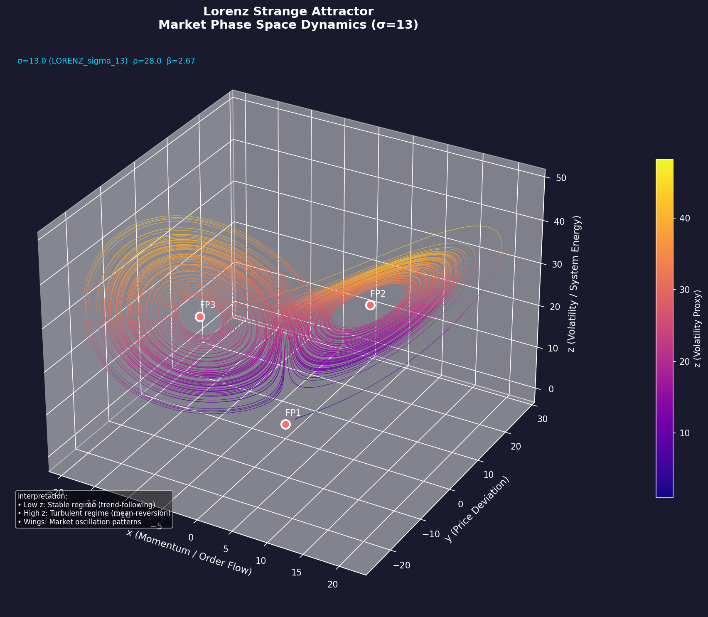
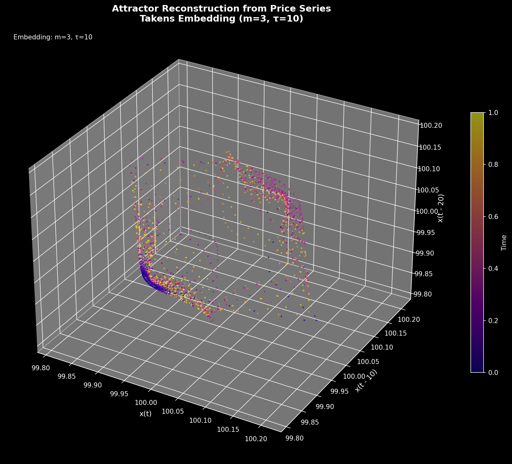
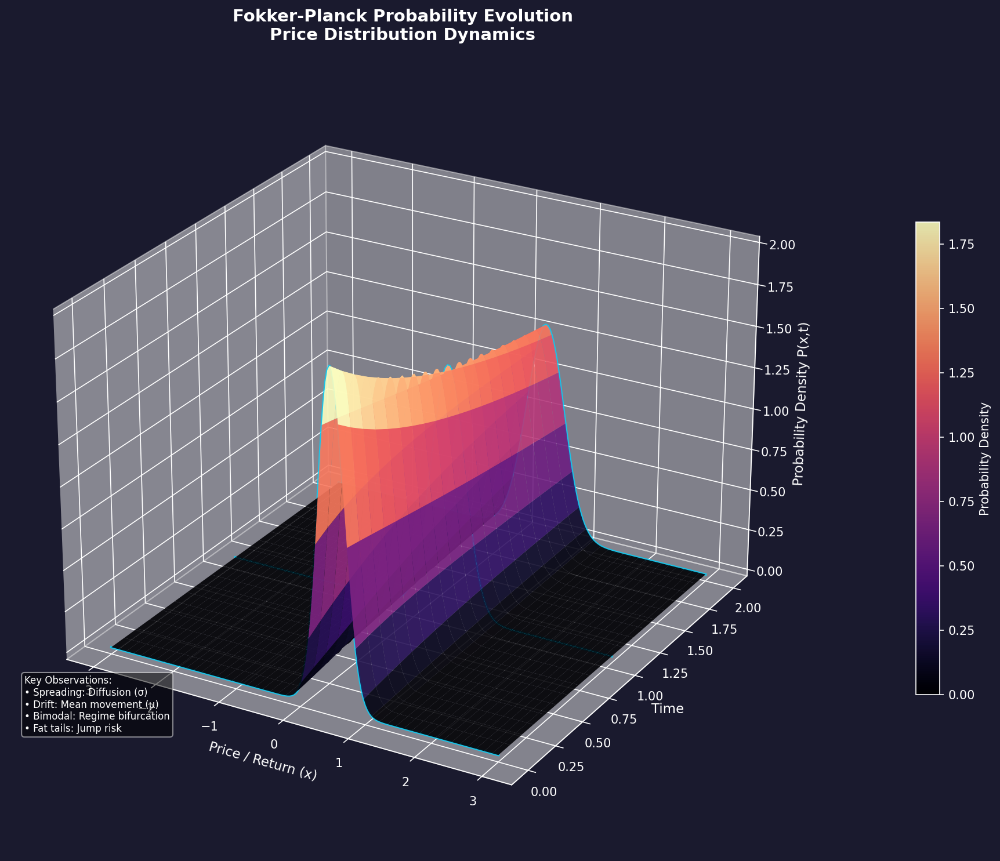
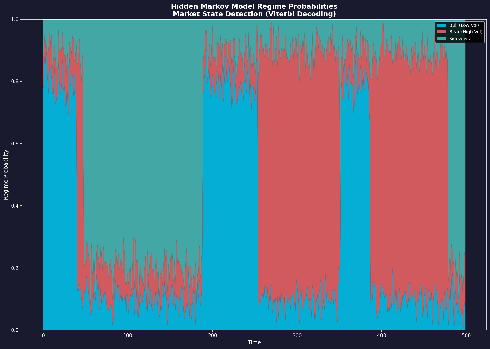
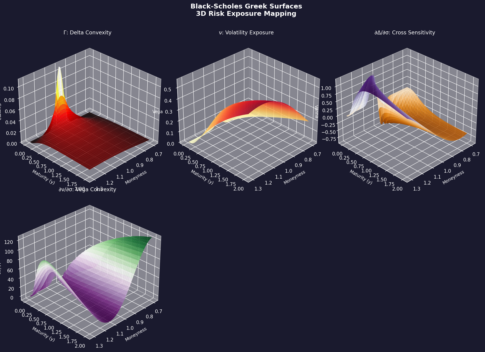
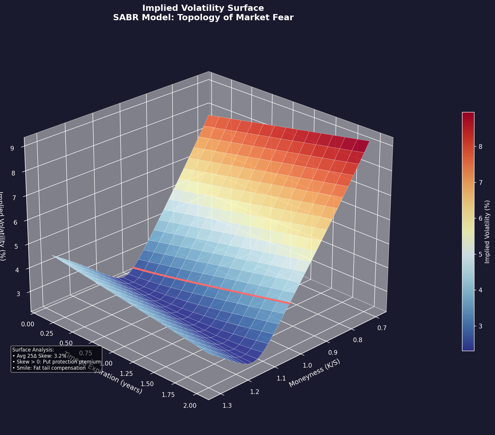

# Quantitative Alpha

## A Unified Framework for Deterministic Chaos, Stochastic Physics, and Advanced Signal Processing in Algorithmic Trading

[](https://www.python.org/downloads/)
[](https://opensource.org/licenses/MIT)
[](https://github.com/psf/black)

---

## Executive Summary

**Quantitative Alpha** represents a paradigm shift in algorithmic trading methodology. This framework bridges the gap between theoretical physics and practical portfolio management by implementing advanced mathematical models derived from chaos theory, stochastic differential equations, and statistical signal processing.

The core innovation lies in treating financial markets not as random walks, but as **deterministic chaotic systems** with identifiable phase space structures. This approach, pioneered by firms such as Renaissance Technologies, enables the extraction of predictable patterns from seemingly random price movements.

### Key Capabilities

- **Lorenz System Integration**: Market microstructure modeling using calibrated chaos parameters (σ=13)
- **Hidden Markov Models**: Real-time regime detection via Baum-Welch and Viterbi algorithms
- **Fokker-Planck Equations**: Probability density evolution for tail risk assessment
- **3D Risk Visualization**: Professional-grade phase space and surface plotting
- **Portfolio Optimization**: Hierarchical Risk Parity and Kelly Criterion implementation

---

## Table of Contents

1. [Introduction](#1-introduction)
2. [Theoretical Foundation](#2-theoretical-foundation)
3. [System Architecture](#3-system-architecture)
4. [Core Modules](#4-core-modules)
5. [Visualization Suite](#5-visualization-suite)
6. [Installation](#6-installation)
7. [Quick Start Guide](#7-quick-start-guide)
8. [Advanced Usage](#8-advanced-usage)
9. [Mathematical Reference](#9-mathematical-reference)
10. [Business Applications](#10-business-applications)
11. [Performance Considerations](#11-performance-considerations)
12. [Contributing](#12-contributing)
13. [License](#13-license)

---

## 1. Introduction

### 1.1 The Convergence of Physics and Finance

Modern quantitative finance stands at a critical inflection point. The classical financial theory, dominated by the Efficient Market Hypothesis (EMH) and linear equilibrium models, has shaped academic and institutional thinking for decades. However, the empirical realities of financial markets increasingly reveal the limitations of these approaches.

**Financial markets do not behave like ideal gases in equilibrium.** They exhibit characteristics of complex, non-linear dynamical systems marked by turbulence, phase transitions, and emergent behavior. This recognition has given rise to **Econophysics**—the application of physical laws and methods to economic problems.

### 1.2 From Random Walk to Market Turbulence

The traditional "random walk" model assumes that price changes are independent and identically distributed (i.i.d.), leading to a normal distribution of returns. Empirical studies consistently demonstrate:

- **Fat Tails**: Extreme events occur far more frequently than Gaussian models predict
- **Volatility Clustering**: High volatility periods tend to cluster together
- **Long-Range Dependencies**: Past events influence future dynamics over extended horizons

These phenomena are **signatures of chaotic systems**, not random noise.

### 1.3 The Renaissance Technologies Approach

The extraordinary success of Renaissance Technologies' Medallion Fund (averaging ~66% annual returns before fees) stems not from economic intuition, but from the rigorous application of:

- **Pattern Recognition**: Borrowed from speech recognition and cryptography
- **Signal Processing**: Filtering noise to extract deterministic structure
- **Statistical Mechanics**: Treating markets as many-body physical systems

This framework implements these methodologies in a modular, production-ready architecture.

---

## 2. Theoretical Foundation

### 2.1 Deterministic Chaos in Market Microstructure

#### 2.1.1 The Lorenz System

The Lorenz system, originally developed by Edward Lorenz in 1963 for atmospheric convection modeling, serves as the prototypical example of deterministic chaos. The system is defined by three coupled non-linear ordinary differential equations:

```
dx/dt = σ(y - x)
dy/dt = x(ρ - z) - y
dz/dt = xy - βz
```

#### 2.1.2 Financial Interpretation of State Variables

| Variable | Physical Meaning | Financial Interpretation |
|----------|-----------------|-------------------------|
| x(t) | Convection rate | Order Flow / Market Momentum |
| y(t) | Temperature difference | Price deviation from equilibrium |
| z(t) | Vertical temperature profile | Volatility / System energy |

#### 2.1.3 The Significance of LORENZ_sigma_13

The parameter σ (Prandtl number) describes the ratio of viscosity to thermal diffusivity in physics. In financial markets:

- **Standard Value (σ=10)**: Typical atmospheric behavior
- **Financial Calibration (σ=13)**: Higher market friction, representing:
  - Slower information processing
  - Greater trend persistence due to "mass inertia"
  - Characteristics of lower-liquidity markets

A higher σ implies that prices (y) react more sluggishly to momentum changes (x), but once a trend establishes, it becomes more difficult to reverse.

### 2.2 Stochastic Physics Models

#### 2.2.1 Langevin Dynamics

The Langevin equation models Brownian motion with friction:

```
dp/dt = -γp(t) + ξ(t) + K(x)
```

Where:
- **-γp(t)** (Dissipation): Market efficiency / arbitrage forces
- **ξ(t)** (Fluctuation): Stochastic noise from information arrival
- **K(x)** (Drift): Fundamental pressure

**Trading Application**: The friction parameter γ determines the half-life of trends:
- High γ → Strong mean reversion → Mean-reversion strategies optimal
- Low γ → Trend persistence → Momentum strategies optimal

#### 2.2.2 Fokker-Planck Equation

The Fokker-Planck equation describes the evolution of probability density:

```
∂P/∂t = -∂/∂x[D¹(x)P] + ∂²/∂x²[D²(x)P]
```

**Application**: Rather than predicting single price paths, this models the evolution of the entire probability distribution. When the distribution becomes bimodal, it signals potential regime bifurcation—a scenario that traditional VaR models miss entirely.

### 2.3 Hidden Markov Models for Regime Detection

Markets are driven by hidden (unobservable) states or regimes that manifest through observable signals. The HMM framework includes:

- **Hidden States**: Market regimes (Bull, Bear, High Volatility, Low Volatility)
- **Observations**: Returns, volume, bid-ask spreads
- **Transition Matrix**: Probabilities of regime changes
- **Emission Distributions**: How each regime generates observations

#### Key Algorithms

| Algorithm | Purpose | Application |
|-----------|---------|-------------|
| Forward-Backward | State probability calculation | Risk assessment |
| Baum-Welch | Parameter training (EM) | Model calibration |
| Viterbi | Real-time state decoding | Live trading signals |

---

## 3. System Architecture

### 3.1 Modular Design Philosophy

The system follows the principle of **Separation of Concerns**, organized into four primary layers:

```
┌─────────────────────────────────────────────────────────────┐
│                    EXECUTION LAYER                          │
│  (Order Management, TWAP/VWAP Algorithms, API Routing)      │
├─────────────────────────────────────────────────────────────┤
│                    PORTFOLIO LAYER                          │
│  (HRP Optimization, Kelly Sizing, Risk Limits)              │
├─────────────────────────────────────────────────────────────┤
│                     ALPHA LAYER                             │
│  (HMM Regime Detection, SDE Simulation, Signal Generation)  │
├─────────────────────────────────────────────────────────────┤
│                      DATA LAYER                             │
│  (Tick Processing, Lorenz Transformation, Feature Vectors)  │
└─────────────────────────────────────────────────────────────┘
```

### 3.2 Data Flow Architecture

| Module | Input | Processing | Output |
|--------|-------|------------|--------|
| Data Layer | Raw Ticks | Resampling, Lorenz Transform (x,y,z) | Feature Vector |
| Alpha Layer | Feature Vector | HMM Viterbi Decoding, SDE Simulation | Market Regime & Signal |
| Portfolio Layer | Signals | HRP Optimization, Kelly Sizing | Target Weights |
| Risk Layer | Target Weights | VaR Check, Greek Limits | Adjusted Orders |
| Execution | Orders | TWAP Algorithm, API Routing | Fills / Transactions |

---

## 4. Core Modules

### 4.1 Chaos Theory Module (`src/core/`)

#### LorenzSystem


*The Lorenz Attractor: 3D phase space visualization of deterministic chaos. The butterfly-shaped attractor demonstrates sensitive dependence on initial conditions - the hallmark of chaotic systems in financial markets.*

```python
from src.core.lorenz import LorenzSystem, transform_prices_to_lorenz

# Initialize with financial calibration
lorenz = LorenzSystem(sigma=13.0, rho=28.0, beta=8/3)

# Generate attractor
trajectory = lorenz.integrate(
    initial_state=[1.0, 1.0, 1.0],
    t_span=(0, 100),
    n_points=50000
)

# Detect market regime
regimes = lorenz.detect_regime(trajectory['trajectory'])

# Transform real prices to Lorenz coordinates
x, y, z = transform_prices_to_lorenz(prices, window=20, sigma=13.0)
```

#### PhaseSpaceReconstructor


*Takens Embedding (m=3, τ=10): Phase space reconstruction from price series reveals the underlying attractor structure. Color gradient represents time evolution.*

```python
from src.core.phase_space import PhaseSpaceReconstructor

# Reconstruct attractor from price series
reconstructor = PhaseSpaceReconstructor()
result = reconstructor.reconstruct(price_series)

print(f"Embedding: m={result['params'].dimension}, τ={result['params'].delay}")
print(f"Attractor dimension: {result['dimension']:.2f}")
print(f"Lyapunov exponent: {result['lyapunov']:.4f}")
```

#### LyapunovExponent

```python
from src.core.lyapunov import LyapunovExponent, StabilityAnalyzer

# Estimate predictability horizon
lyap = LyapunovExponent(dt=1/252)
lle = lyap.largest_from_series(returns)

print(f"Largest Lyapunov Exponent: {lle:.4f}")
print(f"Predictability Horizon: {1/lle:.1f} trading days")

# Rolling stability analysis
analyzer = StabilityAnalyzer(window=50)
stability = analyzer.rolling_stability(returns)
trading_signal = analyzer.generate_signal(stability)
```

### 4.2 Stochastic Models (`src/models/`)

#### Langevin Dynamics

```python
from src.models.stochastic import LangevinDynamics

# Initialize with estimated parameters
langevin = LangevinDynamics(gamma=0.1, sigma=0.2, mu=0.05)

# Simulate price paths
paths = langevin.simulate_paths(S0=100, T=1.0, n_paths=10000)

# Estimate parameters from data
params = langevin.estimate_from_data(returns)
print(f"Half-life of mean reversion: {params['half_life']:.1f} days")
```

#### Fokker-Planck Equation


*Price Distribution Dynamics: Evolution of probability density over time showing spreading (diffusion σ), drift (mean movement μ), and potential regime bifurcation.*

```python
from src.models.stochastic import FokkerPlanck

# Initialize solver
fp = FokkerPlanck(
    drift=lambda x: -0.1 * x,
    diffusion=lambda x: 0.2 * np.ones_like(x),
    x_range=(-3, 3)
)

# Evolve probability density
P0 = fp.initial_gaussian(mean=0, std=0.1)
P_T = fp.evolve(P0, t_final=1.0)

# Risk metrics from distribution
var_95 = fp.value_at_risk(P_T, confidence=0.95)
es_95 = fp.expected_shortfall(P_T, confidence=0.95)
```

### 4.3 Hidden Markov Models (`src/models/hmm.py`)


*Market State Detection via Viterbi Decoding: Stacked area chart showing regime probabilities over time. Bull (low volatility), Bear (high volatility), and Sideways regimes are clearly distinguishable.*

```python
from src.models.hmm import HiddenMarkovRegime, ViterbiDecoder, BaumWelchTrainer

# Train HMM on historical data
hmm = HiddenMarkovRegime(n_states=3, n_features=1)
history = hmm.fit(training_returns, n_iterations=100)

# Real-time regime decoding
decoder = ViterbiDecoder(hmm)
regime_sequence = decoder.decode(recent_observations)
current_regime = regime_sequence[-1]

# Online decoding with confidence
state, log_delta, confidence = decoder.decode_online(new_observation, prior_log_delta)

if confidence > 0.9:
    print(f"High-confidence regime detection: State {state}")
```

### 4.4 Options Analytics (`src/models/options.py`)

#### Black-Scholes Greeks


*3D Risk Exposure Mapping: Visualization of Gamma (Γ: Delta Convexity), Vega (ν: Volatility Exposure), Cross Sensitivity (∂Δ/∂σ), and Vega Convexity (∂ν/∂σ) across moneyness and maturity dimensions.*

```python
from src.models.options import BlackScholes, OptionType

bs = BlackScholes()

# Calculate all Greeks
greeks = bs.all_greeks(
    S=100, K=100, T=0.5, r=0.05, sigma=0.20,
    option_type=OptionType.CALL
)

print(f"Price: ${greeks['price']:.2f}")
print(f"Delta: {greeks['delta']:.4f}")
print(f"Gamma: {greeks['gamma']:.4f}")
print(f"Vega: {greeks['vega']:.4f}")
print(f"Vanna: {greeks['vanna']:.4f}")
print(f"Volga: {greeks['volga']:.4f}")
```

#### Implied Volatility Surface


*SABR Model Volatility Surface: Topology of market fear showing the characteristic volatility smile and term structure. The ATM line (red) highlights at-the-money implied volatility across expirations. Lower moneyness shows higher IV due to put protection premium (skew < 0).*

```python
from src.models.options import ImpliedVolatilitySurface, GreeksSurface

# Generate SABR-calibrated surface
iv_surface = ImpliedVolatilitySurface()
strikes, maturities, iv_grid = iv_surface.generate_sabr_surface(
    S=100, alpha=0.25, beta=0.5, rho=-0.4, nu=0.5
)

# Analyze skew
skew_metrics = iv_surface.analyze_skew(maturity=0.25)
print(f"25-Delta Skew: {skew_metrics['skew_25d']*100:.1f}%")
print(f"Butterfly: {skew_metrics['butterfly_25d']*100:.2f}%")
```

### 4.5 Portfolio Optimization (`src/portfolio/`)

#### Hierarchical Risk Parity

```python
from src.portfolio.hrp import HierarchicalRiskParity

# Optimize portfolio
hrp = HierarchicalRiskParity(linkage_method='single')
result = hrp.optimize(returns)

print(f"Optimal Weights: {result.weights}")
print(f"Asset Order (clustering): {result.asset_order}")

# Risk contribution analysis
risk_contrib = hrp.risk_contribution(result.weights, cov_matrix)
```

#### Kelly Criterion

```python
from src.portfolio.kelly import KellyCriterion, FractionalKelly

kelly = KellyCriterion()

# Continuous Kelly (for stocks)
result = kelly.continuous(mu=0.10, sigma=0.20)
print(f"Optimal Kelly Fraction: {result.optimal_fraction:.2%}")
print(f"Expected Growth Rate: {result.expected_growth:.2%}")
print(f"Half-Kelly (Recommended): {result.half_kelly:.2%}")

# Dynamic fractional Kelly with regime adjustment
fk = FractionalKelly(fraction=0.5, max_leverage=2.0)
position = fk.size_position(
    account_value=1000000,
    kelly_f=0.25,
    regime_confidence=0.85
)
```

---

## 5. Visualization Suite

The framework includes a comprehensive 3D visualization suite designed for physics-based financial modeling.

### 5.1 Available Visualizations

| Visualization | Description | Use Case |
|--------------|-------------|----------|
| Lorenz Attractor | 3D phase space dynamics | Market structure analysis |
| IV Surface | Volatility topology | Tail risk assessment |
| Greeks Surfaces | Multi-dimensional risk | Position management |
| Risk-Return-Time | 3D efficient frontier evolution | Portfolio dynamics |
| Fokker-Planck | Probability density evolution | Distribution forecasting |
| Regime Transitions | HMM state probabilities | Regime monitoring |
| Kelly Surface | Optimal growth rates | Position sizing |
| Phase Portraits | Attractor reconstruction | Pattern recognition |

### 5.2 Generating Visualizations

```python
from src.visualization.quant_viz import QuantVisualization

# Initialize with dark theme
viz = QuantVisualization(figsize=(14, 10), style='dark')

# Generate Lorenz attractor
fig = viz.plot_lorenz_attractor(
    trajectory,
    title="Market Phase Space Dynamics",
    color_by_z=True,
    show_fixed_points=True,
    save_path='figures/lorenz.png'
)

# Generate IV surface
fig = viz.plot_iv_surface(
    strikes, maturities, iv_grid,
    spot=100,
    show_atm=True,
    save_path='figures/iv_surface.png'
)

# Generate Risk-Return-Time
fig = viz.plot_risk_return_time(
    returns, volatilities, times,
    labels=['Conservative', 'Balanced', 'Aggressive'],
    save_path='figures/risk_return_time.png'
)
```

### 5.3 Batch Generation

```bash
# Generate all visualizations
python examples/generate_all_visualizations.py
```

This produces the following in the `figures/` directory:
- `lorenz_attractor.png`
- `iv_surface.png`
- `greeks_surfaces.png`
- `risk_return_time.png`
- `fokker_planck.png`
- `hmm_regimes.png`
- `kelly_surface.png`
- `var_surface.png`
- `attractor_reconstruction.png`
- `shadow_manifold.png`
- `sharpe_surface.png`

---

## 6. Installation

### 6.1 Prerequisites

- Python 3.8 or higher
- pip or conda package manager

### 6.2 Installation Steps

```bash
# Clone the repository
git clone https://github.com/your-org/quantitative-alpha.git
cd quantitative-alpha

# Create virtual environment
python -m venv venv
source venv/bin/activate  # On Windows: venv\Scripts\activate

# Install dependencies
pip install -r requirements.txt

# Install package in development mode
pip install -e .
```

### 6.3 Dependencies

```
numpy>=1.21.0
scipy>=1.7.0
matplotlib>=3.4.0
pandas>=1.3.0
scikit-learn>=0.24.0
```

---

## 7. Quick Start Guide

### 7.1 Basic Workflow

```python
import numpy as np
from src.core.lorenz import LorenzSystem, transform_prices_to_lorenz
from src.models.hmm import HiddenMarkovRegime, ViterbiDecoder
from src.portfolio.hrp import HierarchicalRiskParity
from src.portfolio.kelly import FractionalKelly

# 1. Load price data (example with synthetic data)
np.random.seed(42)
prices = 100 * np.cumprod(1 + np.random.randn(1000) * 0.02)

# 2. Transform to Lorenz coordinates
x, y, z = transform_prices_to_lorenz(prices, window=20, sigma=13.0)

# 3. Train HMM for regime detection
returns = np.diff(np.log(prices))
hmm = HiddenMarkovRegime(n_states=3)
hmm.fit(returns.reshape(-1, 1))

# 4. Decode current regime
decoder = ViterbiDecoder(hmm)
regimes = decoder.decode(returns[-50:].reshape(-1, 1))
current_regime = regimes[-1]

# 5. Optimize portfolio (example with multiple assets)
# returns_matrix = ...  # Your multi-asset returns
# hrp = HierarchicalRiskParity()
# result = hrp.optimize(returns_matrix)

# 6. Size position using Kelly
kelly_sizer = FractionalKelly(fraction=0.5)
position = kelly_sizer.size_position(
    account_value=1000000,
    kelly_f=0.20,
    regime_confidence=0.85 if current_regime == 0 else 0.5
)

print(f"Current Regime: {current_regime}")
print(f"Position Size: ${position['position_value']:,.0f}")
print(f"Leverage: {position['leverage']:.2%}")
```

---

## 8. Advanced Usage

### 8.1 Custom Chaos Parameters

```python
from src.core.lorenz import LorenzParameters, LorenzSystem

# Customize for specific market conditions
params = LorenzParameters(
    sigma=15.0,  # Higher friction for illiquid markets
    rho=32.0,    # More chaotic dynamics
    beta=3.0     # Faster volatility mean reversion
)

lorenz = LorenzSystem(params=params)
```

### 8.2 Multi-Asset Regime Detection

```python
from src.models.hmm import BaumWelchTrainer

# Train on multiple return series
trainer = BaumWelchTrainer(n_states=4, n_features=3)
sequences = [returns_spy, returns_qqq, returns_iwm]

best_model, results = trainer.select_best_n_states(
    observations=np.column_stack(sequences),
    n_states_range=[2, 3, 4, 5]
)

print(f"Optimal number of states: {best_model.n_states}")
```

### 8.3 Path-Dependent Option Pricing

```python
from src.models.path_integral import FeynmanPathIntegral

# Price Asian option
fpi = FeynmanPathIntegral(S0=100, T=1.0, r=0.05, sigma=0.20)

asian_price, stderr = fpi.price_asian_option(
    strike=100,
    option_type='call',
    averaging='arithmetic',
    n_paths=100000
)

print(f"Asian Call Price: ${asian_price:.2f} ± ${stderr:.2f}")
```

---

## 9. Mathematical Reference

### 9.1 Lorenz System Equations

```
dx/dt = σ(y - x)           # Momentum dynamics
dy/dt = x(ρ - z) - y       # Price deviation
dz/dt = xy - βz            # Volatility evolution
```

### 9.2 Langevin Equation

```
dp/dt = -γp(t) + ξ(t)
```

Half-life of mean reversion: `τ₁/₂ = ln(2)/γ`

### 9.3 Fokker-Planck Equation

```
∂P/∂t = -∂/∂x[D¹P] + ∂²/∂x²[D²P]
```

### 9.4 Kelly Criterion

Continuous case: `f* = μ/σ²`

Expected geometric growth: `g* = μ²/(2σ²)`

### 9.5 HMM Equations

Forward algorithm: `α_t(i) = P(O₁,...,O_t, S_t=i)`

Viterbi: `δ_t(i) = max P(S₁,...,S_{t-1}, S_t=i, O₁,...,O_t)`

---

## 10. Business Applications

### 10.1 Systematic Trading Strategies

| Strategy | Module | Signal |
|----------|--------|--------|
| Trend Following | LorenzSystem | Low z-coordinate → Long trends |
| Mean Reversion | LangevinDynamics | High γ → Trade reversals |
| Volatility Trading | FokkerPlanck | Bimodal PDF → Buy straddles |
| Regime Switching | HiddenMarkovRegime | Viterbi transitions → Rebalance |

### 10.2 Risk Management

- **Tail Risk**: Fokker-Planck Expected Shortfall vs. parametric VaR
- **Regime Risk**: HMM confidence thresholds for de-leveraging
- **Greeks Management**: Surface analysis for options books

### 10.3 Portfolio Construction

- **Strategic Allocation**: HRP for long-term diversification
- **Tactical Sizing**: Fractional Kelly with regime adjustment
- **Risk Budgeting**: Equal Risk Contribution portfolios

---

## 11. Performance Considerations

### 11.1 Computational Complexity

| Operation | Complexity | Typical Runtime |
|-----------|------------|-----------------|
| Lorenz Integration | O(n) | <100ms for 50k points |
| HMM Training | O(n × k²) | ~1s for 1000 obs, 3 states |
| Viterbi Decoding | O(n × k²) | <10ms for 100 obs |
| HRP Optimization | O(n² × k) | ~100ms for 50 assets |

### 11.2 Memory Usage

- Lorenz trajectories: ~400 KB per 50,000 points
- HMM models: ~10 KB per state
- IV surfaces: ~1 MB per grid

### 11.3 Optimization Tips

```python
# Use sparse matrices for large covariance matrices
from scipy.sparse import csr_matrix

# Vectorize operations where possible
# Pre-allocate arrays for Monte Carlo simulations
paths = np.zeros((n_paths, n_steps + 1))
```

---

## 12. Contributing

We welcome contributions from the quantitative finance and physics communities.

### 12.1 Development Setup

```bash
# Install development dependencies
pip install -r requirements-dev.txt

# Run tests
pytest tests/

# Check code style
black --check src/
flake8 src/
```

### 12.2 Contribution Guidelines

1. Fork the repository
2. Create a feature branch (`git checkout -b feature/amazing-feature`)
3. Commit changes (`git commit -m 'Add amazing feature'`)
4. Push to branch (`git push origin feature/amazing-feature`)
5. Open a Pull Request

---

## 13. License

This project is licensed under the MIT License - see the [LICENSE](LICENSE) file for details.

---

## Acknowledgments

This framework draws inspiration from:

- Edward Lorenz's pioneering work on deterministic chaos
- Jim Simons and Renaissance Technologies' approach to quantitative trading
- Marcos Lopez de Prado's research on portfolio optimization
- The broader Econophysics community

---

## Contact

For questions, issues, or collaboration inquiries:

- **GitHub Issues**: [Report bugs or request features](https://github.com/your-org/quantitative-alpha/issues)
- **Documentation**: Full API documentation available in `/docs`

---

*"In a world governed by uncertainty, mastery lies not in predicting the future price, but in understanding the distribution of possible futures and the physics of their evolution."*

— Quantitative Alpha Research Team
